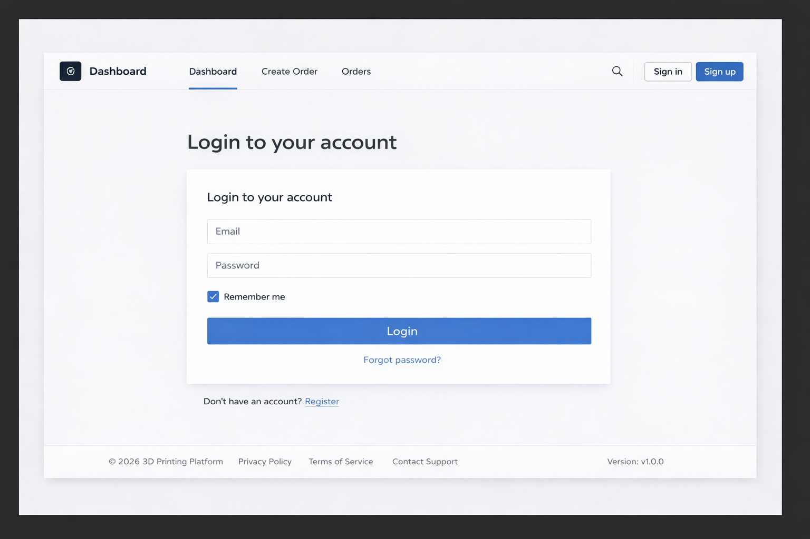
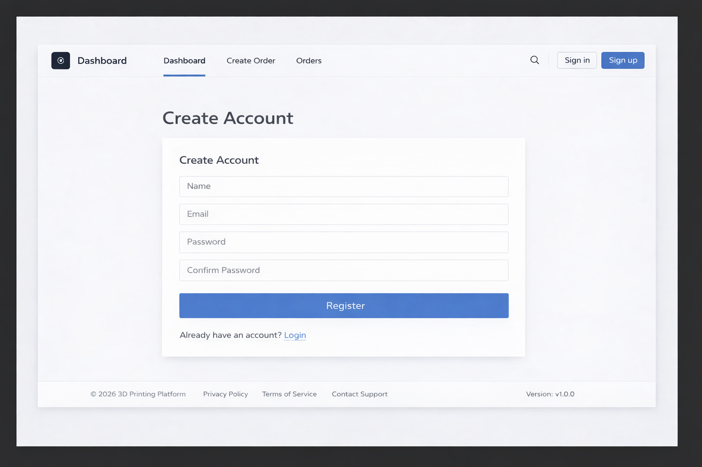
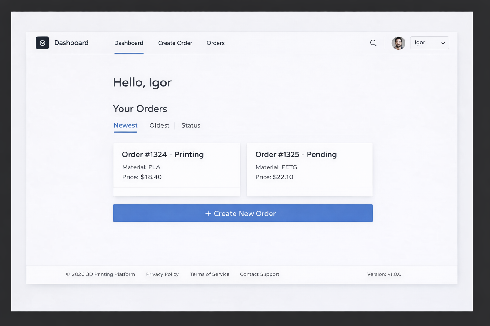
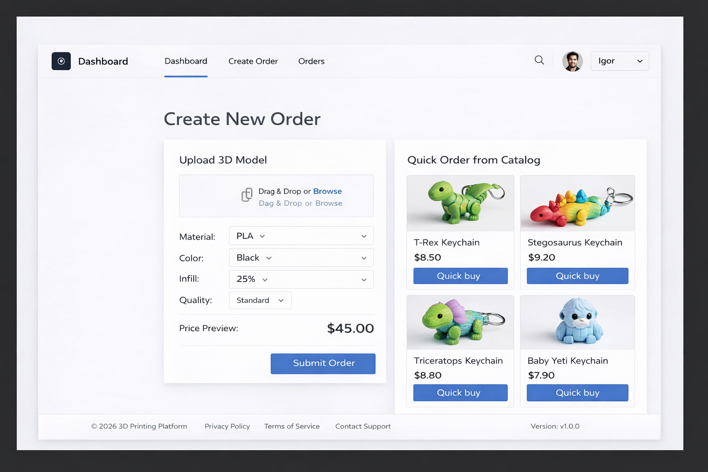
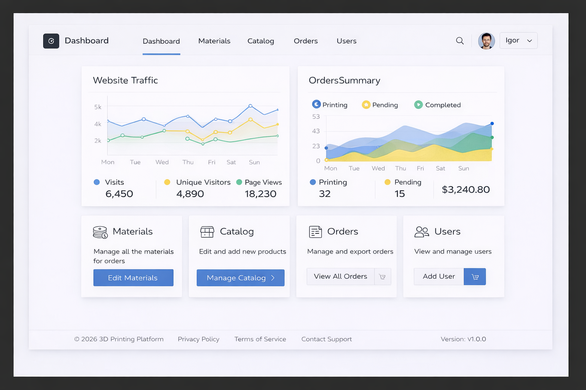
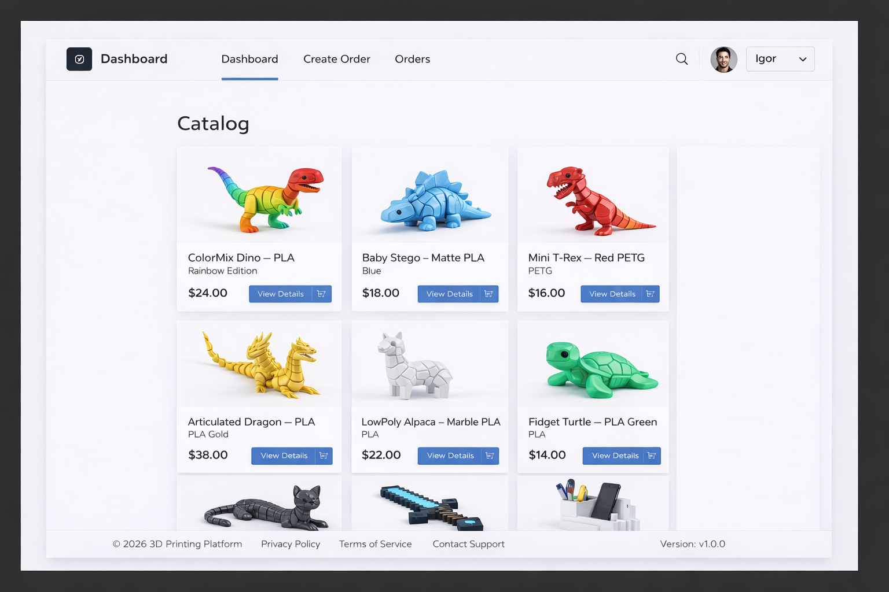
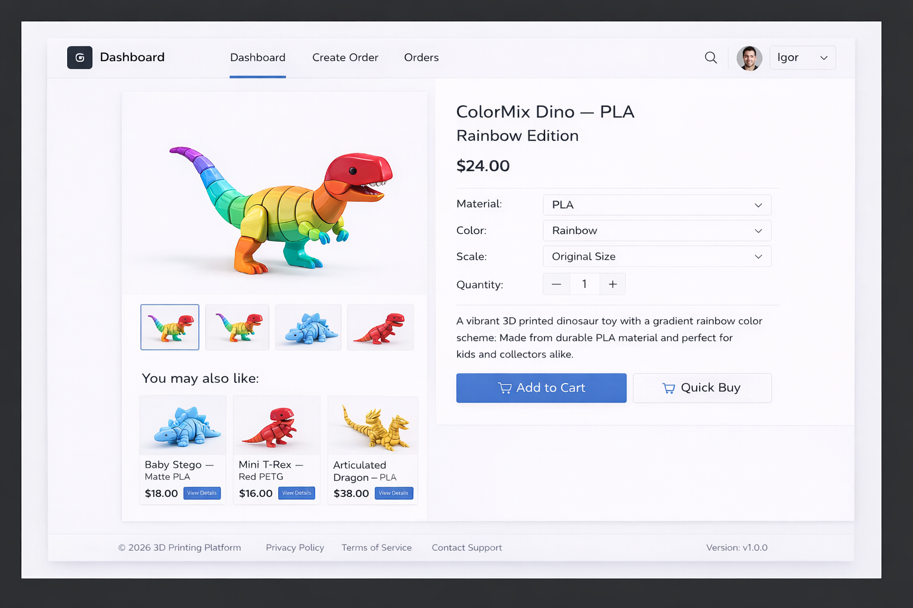

# 3D Printing Management Platform

## Project Overview

**3D Printing Management Platform** is a web-based application designed to manage the complete lifecycle of 3D printing orders.
Users can upload 3D model files, request prints, and track order status. Admin manage the printing queue,oversee pricing, materials, and workflow.
The system includes role-based access, automatic price calculation, order status tracking, and order history.

## Project Goals

* Simplify the process of ordering 3D prints
* Automate price calculation based on selected materials and print parameters
* Provide real-time order status tracking
* Enable efficient print queue management
* Support administrative control over pricing and materials

## Project Features

### User (Customer)

* User registration and authentication
* Upload 3D model files (STL / OBJ)
* Select material, color, and quantity
* Automatic price calculation
* Create print orders
* Track order status
* View order history

### Administrator (Admin)

* View and manage all orders
* Manage order status (Pending, Printing, Completed, Cancelled)
* Manage printing workflow
* Manage materials and pricing
* View user activity and order history

### Super Administrator (Super Admin)

* Full system access
* Manage administrators and user roles
* Configure global system settings
* Override pricing and workflow rules
* Access system-wide reports and data

## Security

* Role-based access control (User, Admin, Super Admin)
* Authentication and authorization
* Restricted access to administrative functions

## Screen Mockups 

### Login / Registration

### User Dashboard

### Create Order

### Admin Panel

### Catalog page

### Product page

